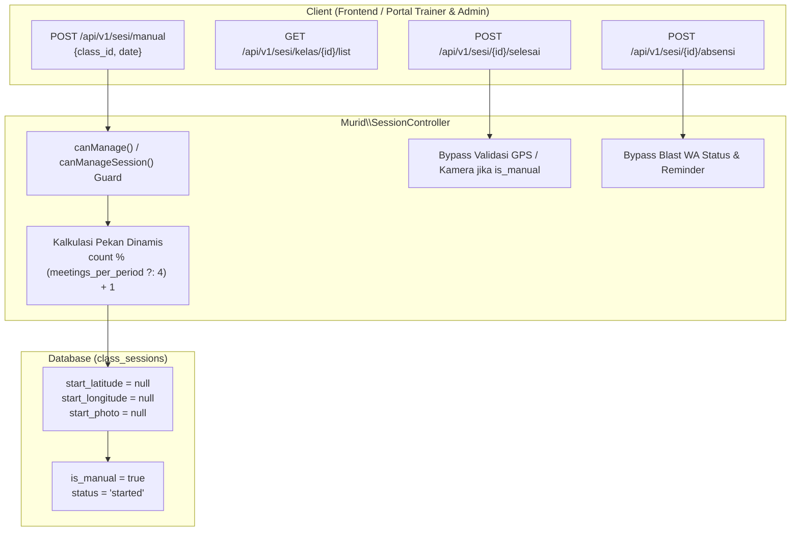

# Dokumentasi Teknis Phase 4: Manajemen Sesi Manual & Penanganan Kelas Pending

Dokumen ini menjelaskan arsitektur, spesifikasi API, aturan otorisasi, penyesuaian siklus absensi, serta integrasi frontend untuk fitur **Pembuatan Sesi Manual (Susulan) dan Penanganan Kelas Pending** pada sistem Robotiku ERP.

---

## 1. Latar Belakang & Identifikasi Masalah

Sebelum implementasi ini, sistem presensi dan sesi kelas memiliki beberapa batasan operasional:

### 1.1. Keharusan Presensi Live (GPS & Kamera Wajib)
- Awalnya, sesi kelas hanya dapat dimulai secara langsung (*real-time*) melalui endpoint `POST /api/v1/sesi/mulai`, yang mewajibkan data koordinat GPS trainer serta foto selfie sebagai bukti kehadiran di lokasi sekolah/kantor.
- Jika terjadi kendala teknis di lapangan (koneksi buruk, baterai habis, atau GPS tidak mengunci), atau saat kelas harus digeser (*reschedule*) dan dicatat secara susulan, trainer tidak dapat membuka sesi karena tidak berada di titik koordinat sekolah pada waktu penginputan data.

### 1.2. Penanganan Kelas Pending & Sesi Susulan
- Pada kondisi tertentu di lapangan (libur tak terduga, kegiatan sekolah, atau trainer berhalangan), jadwal sesi kelas menjadi *pending*.
- Trainer atau administrator membutuhkan sarana untuk mencatat sesi yang sudah berjalan di hari sebelumnya (*backdated session*) tanpa terhalang validasi radius geofence maupun verifikasi selfie kepulangan.

### 1.3. Fleksibilitas Kuota Sesi Kontrak (MoU)
- Sesi tidak selalu berjumlah kaku 4 sesi per periode. Skema kerjasama kemitraan dengan sekolah dapat bervariasi (misal: 6, 8, atau 12 sesi per periode tagihan/rapor).
- Nomor pekan (*week*) harus dihitung secara modular berdasarkan kuota sesi kelas (`classes.meetings_per_period`), bukan nilai konstan 4.

### 1.4. Pencegahan Spam Notifikasi WhatsApp
- Pada sesi langsung (*real-time*), sistem secara otomatis mem-blast pesan WhatsApp ke orang tua saat sesi dimulai, saat absensi per murid disimpan, dan saat tagihan SPP jatuh tempo.
- Pada sesi manual (susulan), pengiriman notifikasi instan WhatsApp ini berpotensi membingungkan orang tua siswa karena sesi tersebut dicatat di luar jam belajar riil.

---

## 2. Arsitektur & Spesifikasi Teknis Backend



### 2.1. Perubahan Skema Database
Migrasi `make_start_fields_nullable_in_class_sessions_table` mengubah kolom-kolom berikut pada tabel `class_sessions` menjadi `nullable`:
- `start_latitude` (`decimal(10,8)` atau `double` nullable)
- `start_longitude` (`decimal(11,8)` atau `double` nullable)
- `start_photo` (`string` nullable)
- `is_manual` (`boolean`, default: `false`)

### 2.2. Spesifikasi Endpoint API

#### A. Pembuatan Sesi Manual
- **Method & URI:** `POST /api/v1/sesi/manual`
- **Middleware:** `auth:sanctum`, `role:trainer,admin,super_admin`
- **Payload Request:**
  ```json
  {
    "class_id": 12,
    "date": "2026-09-28"
  }
  ```
- **Validasi:**
  - `class_id`: `['required', 'exists:classes,id']`
  - `date`: `['required', 'date']`
- **Otorisasi:**
  Trainer harus terdaftar pada kelas (`classes.trainer_id` atau pivot `class_trainers`), atau pengguna memiliki role `admin`/`super_admin`.
- **Penentuan Pekan (*Week Number*):**
  ```php
  $perPeriod = max(1, (int) ($kelas->meetings_per_period ?: 4));
  $week = (Session::where('class_id', $kelas->id)->count() % $perPeriod) + 1;
  ```
- **Response `201 Created`:**
  ```json
  {
    "status": true,
    "message": "Sesi manual dibuat.",
    "data": {
      "id": 85,
      "class_id": 12,
      "week": 3,
      "trainer_id": 4,
      "started_at": "2026-09-28T00:00:00.000000Z",
      "status": "started",
      "is_manual": true,
      "start_latitude": null,
      "start_longitude": null,
      "start_photo": null
    }
  }
  ```

#### B. Daftar Sesi Kelas
- **Method & URI:** `GET /api/v1/sesi/kelas/{kelas}/list`
- **Response:** Menyertakan informasi kelas dan array riwayat sesi dengan field `is_manual`, `started_at`, `status`, dan agregasi `hadir`.

#### C. Pengisian Absensi pada Sesi Manual
- **Method & URI:** `POST /api/v1/sesi/{session}/absensi`
- **Penanganan Khusus Sesi Manual:**
  - **Dapat diisi kapan saja:** Pada sesi manual, absensi tetap dapat dicatat atau diperbaiki meskipun status sesi sudah `ended` (`if (! $session->is_manual && $session->status === 'ended') return error(...)`).
  - **Suppress WA Notification:** Notifikasi WhatsApp orang tua (kehadiran dan reminder tagihan) dinonaktifkan untuk sesi manual agar tidak memicu kebingungan wali murid.

#### D. Penutupan Sesi Manual
- **Method & URI:** `POST /api/v1/sesi/{session}/selesai`
- **Penanganan Khusus Sesi Manual:**
  - Jika `$session->is_manual === true`, penutupan sesi langsung memperbarui `ended_at = now()` dan `status = 'ended'` tanpa menuntut form input koordinat GPS atau foto selfie kepulangan.

---

## 3. Integrasi Antarmuka Frontend (`frontend-robotiku`)

Implementasi frontend terpusat pada dua halaman utama:

### 3.1. Daftar Sesi Kelas & Dialog Sesi Manual
- **File:** `app/(internal)/app/sesi/kelas/[id]/page.tsx`
- **Fitur Antarmuka:**
  - Tombol **"Sesi Manual (Susulan)"** dengan dialog modal `ManualDialog`.
  - Input form pemilihan tanggal sesi (dibatasi maksimal hari ini: `max={new Date().toISOString().slice(0, 10)}`).
  - Kartu riwayat sesi menampilkan label pembeda:
    - Badge **Manual** (warna amber: `border-amber-200 bg-amber-50 text-amber-700`)
    - Badge **Langsung** (warna netral: `border-slate-200 bg-slate-50 text-slate-600`)

### 3.2. Form Presensi & Penutupan Sesi
- **File:** `app/(internal)/app/sesi/[id]/page.tsx`
- **Fitur Antarmuka:**
  - Menampilkan badge indikator sesi manual pada header halaman.
  - Tombol aksi penutupan sesi berupa tombol **"Tandai Selesai"** sederhana (memanggil `manualEnd.mutate()` langsung tanpa memunculkan dialog kamera/GPS).
  - Logika kunci kartu absensi adaptif:
    ```typescript
    const isManual = !!data?.session.is_manual;
    const finished = data?.session.status === "ended";
    const locked = finished && !isManual; // Sesi manual tetap terbuka untuk pengeditan susulan
    ```

---

## 4. Pengujian & Verifikasi Mutu

Fitur ini dilindungi oleh automated feature tests pada file [`tests/Feature/Murid/ManualSessionTest.php`](file:///c:/Users/Fjontoldesk/Documents/Projects/robotiku-erp/backend-robotiku/tests/Feature/Murid/ManualSessionTest.php):

1. **`test_trainer_can_create_manual_session_with_null_geo_and_photo`**
   - Memastikan trainer terotorisasi dapat membuat sesi manual.
   - Memastikan kolom `start_latitude`, `start_longitude`, dan `start_photo` tersimpan sebagai `null` di basis data.
   - Memastikan `is_manual = true` dan `status = 'started'`.

2. **`test_unauthorized_trainer_cannot_create_manual_session`**
   - Memastikan trainer yang tidak mengampu kelas terkait ditolak dengan respons status `403 Forbidden`.

Eksekusi pengujian:
```bash
php artisan test tests/Feature/Murid/ManualSessionTest.php
```
Hasil: `2 passed, 9 assertions` (100% lulus).
