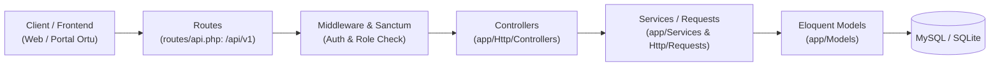

# Onboarding Guide: Robotiku ERP Backend

## Overview
**Robotiku ERP Backend** adalah sistem manajemen operasional sekolah dan kursus robotika berbasis **Laravel 13 (PHP 8.3)**. Sistem ini mencakup manajemen registrasi siswa, kelas & absensi, verifikasi pembayaran/finansial, kurikulum, serta portal e-rapor untuk siswa dan orang tua.

---

## Tech Stack

| Layer | Teknologi | Versi / Detail |
|---|---|---|
| **Runtime & Bahasa** | PHP | `^8.3` |
| **Framework** | Laravel | `^13.8` |
| **Database & ORM** | MySQL / SQLite | Eloquent ORM |
| **Autentikasi & API** | Laravel Sanctum | Token-based REST API (`/api/v1`) |
| **Security & Middleware** | Akaunting Firewall | `^3.0` |
| **Media & Dokumen** | Intervention Image & DomPDF | `intervention/image: ^4.1`, `dompdf: ^3.1` |
| **Impor & Ekspor Data** | Maatwebsite Excel | `^3.1` |
| **Testing & Linting** | PHPUnit & Laravel Pint | PHPUnit `^12.5`, Pint `^1.27` |
| **Dev Tools** | Vite & Concurrently | Task runner & log aggregation |

---

## Architecture & Data Flow



### Request Lifecycle:
1. **Entry**: Permintaan masuk ke `routes/api.php` dengan prefix `/api/v1`.
2. **Security & Guard**: Melewati Akaunting Firewall dan Sanctum auth tokens / role permission checks.
3. **Validation**: Validasi input dilakukan via *Form Request* di `app/Http/Requests`.
4. **Business Logic**: Ditangani oleh Controller atau didelegasikan ke layer service di `app/Services/`.
5. **Database**: Berinteraksi dengan database melalui Eloquent Models di `app/Models/`.

---

## Key Entry Points & Directory Map

| Direktori / File | Fungsi & Peran |
|---|---|
| `routes/api.php` | Definisi semua endpoint REST API v1 |
| `app/Http/Controllers/` | Handler request per modul (Siswa, Kelas, Absensi, Pembayaran, dll.) |
| `app/Models/` | Entitas database dan relasi antar tabel |
| `app/Services/` | Logika bisnis yang kompleks dan reusable |
| `database/migrations/` | Skema tabel database |
| `tests/Feature/` | Pengujian fungsional dan kontrak endpoint API |
| `AGENTS.md` | Konvensi proyek, instruksi development, dan git guidelines |

---

## Conventions & Standards

- **PSR-12 & Clean Code**: Ditegakkan menggunakan Laravel Pint.
- **Git Branching**:
  - `main`: production-ready.
  - `development`: staging utama.
  - `feature/<nama-fitur>`: pengembangan fitur baru.
- **Commit Format**:
  `<type>(scope): <deskripsi>` (contoh: `feat(payment): add manual session generator`, `fix(auth): fix logout token revocation`).
- **Immutable Rules**:
  - Jangan memodifikasi kontrak API atau struktur respon yang sudah ada tanpa kesepakatan tim.
  - Tambahkan unit/feature test sebelum melakukan refactor atau penambahan fitur baru.

---

## Common Development Commands

```bash
# Initial setup
composer run setup

# Menjalankan server lokal lengkap (Laravel + Queue + Logs + Vite)
composer run dev

# Menjalankan seluruh test suite
composer run test

# Menjalankan single test
php artisan test --filter=YourTestName

# Cek daftar route API
php artisan route:list --path=api

# Formatting kode
./vendor/bin/pint
```

---

## Quick Reference: Where to Look

| Jika ingin... | Periksa direktori / file... |
|---|---|
| Menambah / mengedit endpoint API | `routes/api.php` |
| Mengubah aturan pembayaran / invoice | `app/Http/Controllers/Payment/` & `app/Services/` |
| Menangani sesi kelas & absensi | `app/Http/Controllers/ClassSession/` |
| Mengubah relasi atau query model | `app/Models/` |
| Membuat skema tabel baru | `database/migrations/` |
| Menulis test case baru | `tests/Feature/` |
